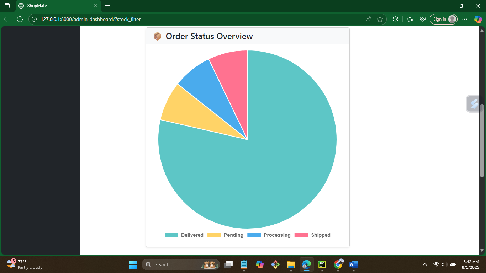

# 🛒 ShopMate

[](https://www.python.org/downloads/)
[](https://docs.djangoproject.com/en/stable/)
[](https://getbootstrap.com/)
[](LICENSE)
[](#)


**ShopMate** is a fully functional **e-commerce web application** built with Django.  
It includes both **essential** and **advanced** features such as product management, shopping cart,  
order checkout, user-specific order history with PDF/CSV export, profile management,  
and a powerful admin dashboard with **interactive charts** and **stock management**.

---

## 📚 Table of Contents
- [🚀 Features](#-features)
- [🧪 Tech Stack](#-tech-stack)
- [📸 Screenshots](#-screenshots)
- [⚙️ Setup Instructions](#️-setup-instructions)
- [🌐 Live Demo](#-live-demo)
- [📜 License](#-license)

---

## 🚀 Features

### 👤 **User Features**
✅ User Registration with Email Confirmation  
✅ Secure Login and Logout  
✅ Profile Management (Update Name, Email, Password)  
✅ Upload Profile Picture  
✅ Manage Shipping Address (Add/Update)  
✅ Product Listing and Detail Pages  
✅ Add to Cart / Remove / Update Quantity  
✅ Checkout with Name, Address, and Phone  
✅ View Order History (Filtered by Month & Year)  
✅ Export Order History (PDF and CSV)  
✅ Submit, Edit, and Delete Product Reviews  

### 🛠 **Admin Features**
✅ Manage Products (Add/Edit/Delete)  
✅ Upload Product Images via Form (Not Only in Admin Panel)  
✅ View and Manage Orders  
✅ Update Order Status (Processing → Shipped → Delivered)  
✅ Manage Stock (Update Quantity Directly from Dashboard)  
✅ Review Moderation (Approve/Reject Reviews)  
✅ Contact Messages Management  
✅ Admin Activity Logs  

📊 **Enhanced Admin Dashboard Charts**  
- **Orders Per Month** – Professional gradient bar chart with rounded corners & smooth animations  
- **Monthly Sales** – Peso-formatted gradient bar chart for visualizing revenue trends  
- **Order Status Overview** – Interactive pie chart with percentage tooltips  
- **Product Stock Table** – Filter products by Low Stock or Out of Stock  

---

## 🧪 Tech Stack

- **Backend**: [Django 5+](https://docs.djangoproject.com/en/stable/)  
- **Frontend**: [Bootstrap 5](https://getbootstrap.com/)  
- **Database**: SQLite (default, can switch to PostgreSQL/MySQL)  
- **Charts**: [Chart.js](https://www.chartjs.org/)  
- **PDF Export**: [WeasyPrint](https://weasyprint.org/)  
- **CSV Export**: Python CSV module  
- **Email System**: Django Email + Token System  

---

## 📸 Screenshots

### 🏠 Homepage


### 🛒 Cart Page


### 📋 Checkout Form


### 📦 Order History


### 🧾 PDF Invoice Sample


### 📝 Manage Reviews


### 📊 Admin Dashboard (Orders Per Month + Monthly Sales + Order Status)


### 📊 Admin Dashboard (Order Status)


### 📦 Manage Stock (Low Stock & Out of Stock Filters)


---

## ⚙️ Setup Instructions

```bash
# Clone the repository
git clone https://github.com/Juven65/shopmate.git
cd shopmate

# Create a virtual environment
python -m venv venv

# Activate it
# Windows
venv\Scripts\activate
# Mac/Linux
source venv/bin/activate

# Install dependencies
pip install -r requirements.txt

# Migrate the database
python manage.py migrate

# Create superuser (optional)
python manage.py createsuperuser

# Run the development server
python manage.py runserver
